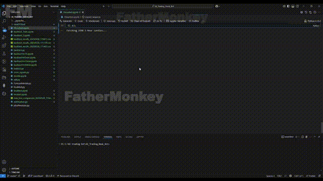

# AI Trading Bot | Data To Dollar V2.1 | DToD

This repository contains an AI-powered trading bot designed for short-term price prediction and pattern detection in financial markets. The bot leverages advanced machine learning models and technical indicators to assist in making informed trading decisions.

### DTDv2.1_backtest_7days

### DTDv2.1_backtest_30days

### DTDv2.1_backtest_90days

## Main Features

### Short-term price prediction using the TimeMixer++ model  
Enables accurate forecasting of market movements.

  

---

### Pattern detection implemented with the YOLO (You Only Look Once) model  
Identifies key chart patterns and signals.\
The project uses two special YOLO models to find patterns in stock charts.\
-The other finds small candlestick shapes like Marubozu or Morning Star.\
  

-One model finds big chart shapes like cup-and-handle or double bottom.\

---

### Customizable technical indicators  
Tailored to user preferences for enhanced analysis.

# 🔐

---

### Integration of popular indicators such as RSI and MACD  
Provides comprehensive market assessment.

The combination of deep learning models and traditional indicators provides a robust framework for algorithmic trading strategies.

# Contact Info
Email: benreydiohenfilio.john916@gmail.com \
Telegram: @johnbdfilio000
